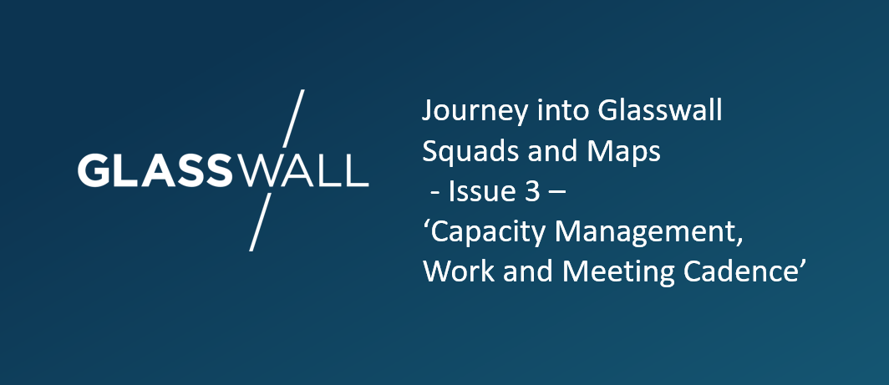

# Title: Capacity Management and Work/Meeting balance

[slideshare - Glasswall 'Squads and Maps - Part 2'](https://www.slideshare.net/LukeRobbertse/glasswall-squads-and-maps-pt2-217174456)

In this blog we cover two important topics and ones that have been discussed at length these past few weeks.
Both topics are closley related and ultimately tackle the productivity issue presented by distraction and task switching. 

## Capacity Management

Where previously an individual was a member of one team and teams were assigned work, at a high level it is clear what 
work someone should be focusing their time one. We all know this is not reality but at face value it's simple enough. 
Now individuals can be a part of multiple squads, each squad working on a different outcome. We still have our team structure which
aligns with our organisational chart and defines line management structure, very important. But work that is done is in the form 
of a cross functional squad and we encourage staff to be involved as many squads as is suitable for them. Everyone is different, 
some might prefer to remain focused on a single squad, where another person might want to spend half the week focused on one squads
outcome and half the week on another. We could even have an engineer spending one day a week trying their hand at some design work
in a squad delivering to an internal stakeholder and not a client. Either way, a common question has been asked: How do I manage 
my time commitment across multiple squads?

### A good question indeed and one desperate for an answer and a solution
We iterated over how to deal with this. We tried to come up with a good way for people to manage their own time commits
to different squads. We thought of using sub links between our Issues on Jira and see if we could an intermediary link between a 
Person and the Sqauds they are mapped to, that included a time commitment measured in Hours Per Week. This was not going to work
and required too much engineering in Jira. We then attempted using airtable as a store of everyones squad commitments and how many 
hours per week they were committing to each of their squads. This too was not a natural integration and a large amount of technical
resistance was surfacing as we went down this path.

We then realised that we over thinking and over engineering for a potential future problem that we did not yet have. We were 
trying to create a way to specifically track and measure everyones time and an ove an over engineered approach at that.
We realised the need for a simpler way to address this and put the trust in our people to manage it themselves.

### Proposal

Individual:
- Manage their own time and squad commitments and contributions. 

Squad Leader:
- Negotiates with the individual how much time they will contribute to squad.
- Ensures that their contributors are effectively delivering against their outcomes
- Accountable for having the right roles and time commits in their squad

Line Manager: 
- Responsible for monitoring the health of each person. Not stretched too thin or task switching to much. Has the right amount of squad contributions for the individual
- Squad contributions is aligned to their PDP, etc
- Conflict resolution for squad commitments.
- Review each of your Team Members and make sure they are appropriately mapped.

